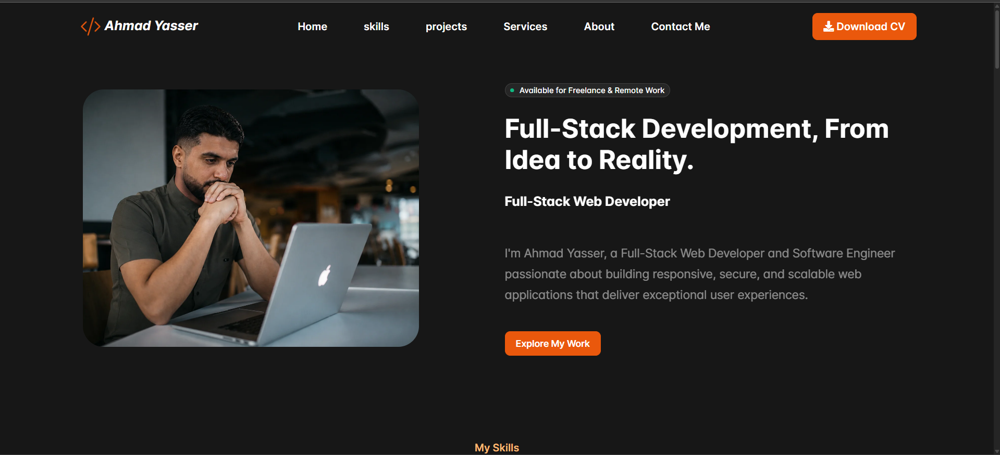
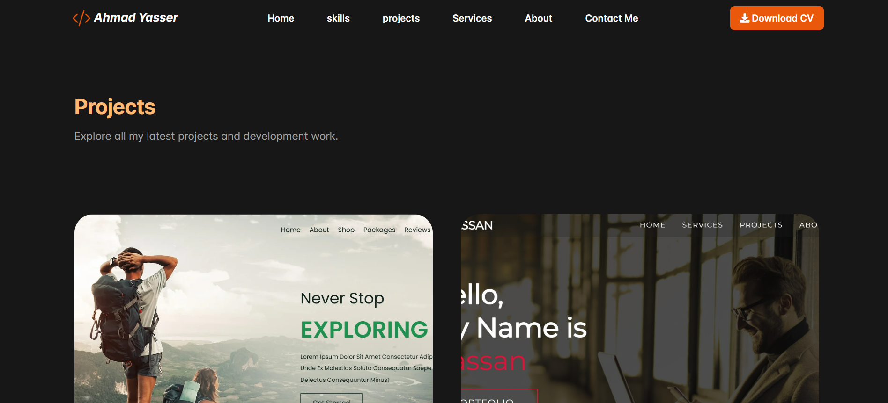
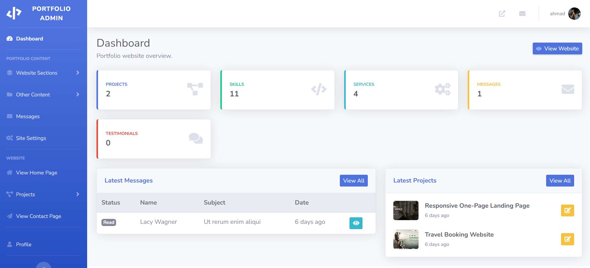
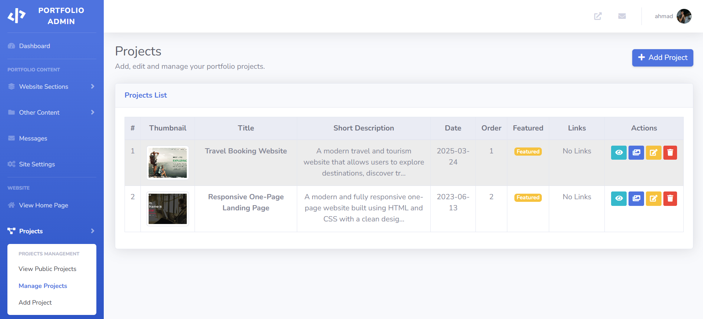

# Personal Portfolio & CMS

A modern, responsive personal portfolio website developed with Laravel.  
The project includes a custom Content Management System (CMS) that allows website content to be managed dynamically through an administration dashboard.

## 🚀 Features

- Responsive and modern portfolio design
- Custom admin dashboard
- Dynamic navigation management
- Hero section management
- About section management
- Education management
- Technical skills management
- Projects and project gallery management
- Services management
- Testimonials management
- Social media links management
- Call-to-action management
- Contact messages management
- Dynamic website settings
- Dynamic SEO metadata
- Authentication for the administration dashboard

## 🛠️ Technologies Used

- PHP
- Laravel
- MySQL
- HTML5
- CSS3
- JavaScript
- Bootstrap
- Git & GitHub

## 📸 Screenshots

### 🏠 Home Page



### 💼 Projects Page



### ⚙️ Admin Dashboard



### 📂 Project Management



## ⚙️ Installation

Clone the repository:

```bash
git clone https://github.com/Ahmad4505/My_portfolio.git
```

Navigate to the project directory:

```bash
cd My_portfolio
```

Install PHP dependencies:

```bash
composer install
```

Install frontend dependencies:

```bash
npm install
```

Create the environment file:

```bash
cp .env.example .env
```

Generate the application key:

```bash
php artisan key:generate
```

Configure your database credentials in the `.env` file, then run:

```bash
php artisan migrate
```

Build the frontend assets:

```bash
npm run build
```

Start the development server:

```bash
php artisan serve
```

## 🎯 Project Purpose

This project was developed to demonstrate my practical experience in full-stack web development using Laravel, including MVC architecture, database design, authentication, content management, responsive user interfaces, and dynamic website administration.

## 👨‍💻 Author

**Ahmad Yaser Hasan Alkahlout**

Software Engineer | Web Developer

- GitHub: [Ahmad4505](https://github.com/Ahmad4505)
- LinkedIn: [Ahmad El Kahlout](https://www.linkedin.com/in/ahmad-el-kahlout)
